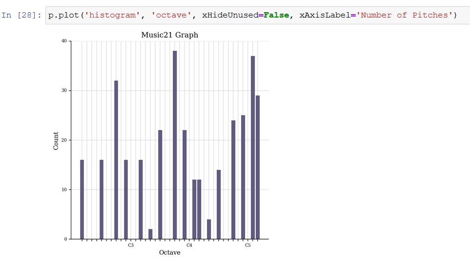
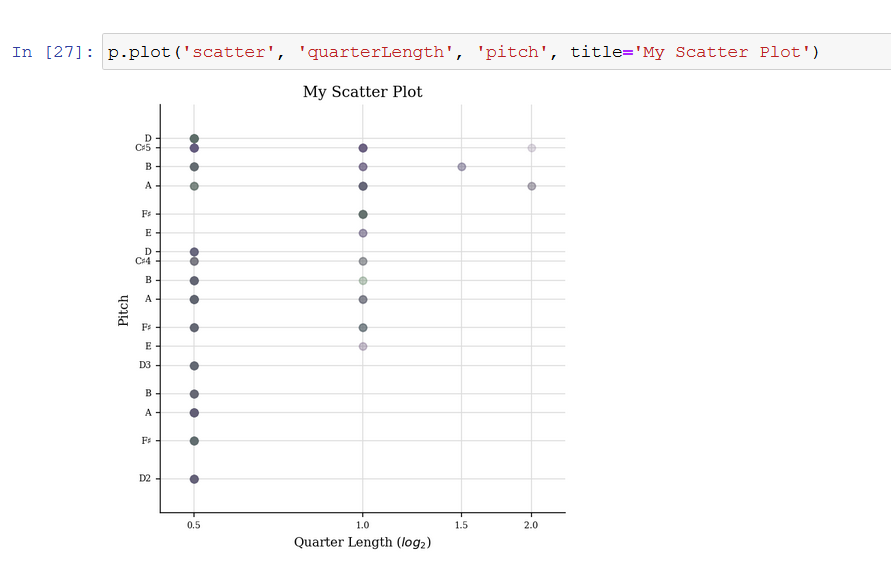
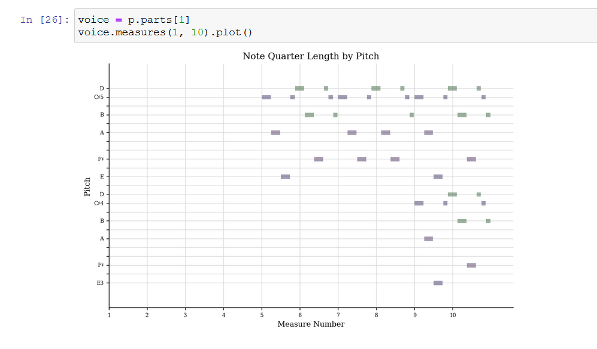

| [WEEK 1](README.md) | [WEEK 2](week1.md) | [WEEK 3](week3.md) | [WEEK 4](week4.md) | [WEEK 5](week5.md) | [WEEK 7](week7.md) | [WEEK 8](week8.md) | [WEEK 9](week9.md) | [WEEK 10](week10.md) |
| --- | --- | --- | --- | --- | --- | --- | --- | --- |

# Week 4: Basic Analytics

## Task 1: Generating a jSymbolic

In generating a jSymbolic of my piece, I have selected a group of features that I believe can be interesting for my piece:

Number of Pitches: 17

Number of Pitch Classes: 6

Number of Common Pitches: 3

Number of Common Pitch Classes: 2

Range : 36

Strong Tonal Centres: 2

Mean Pitch: 58.82

Mean Pitch Class: 6.209

Most Common Pitch: 57

Most Common Pitch Class: 9

Interval Between Most Prevalent Pitches: 16

Pitch Variability: 11.33

Initial Tempo: 122

Mean Tempo: 122

Note Density: 8.39

You can find a link to the csv [here](featurevalues.csv)

## Task 2: Generating a piano roll and pitch histogram

The pitch histogram shows the number of times a particular note has been played in a song. 

The extracted piano roll shows the order, length, and pitch of the notes played accross time.

The extracted scatter plot of pitches plots pitch against note length.

[NEXT WEEK](week5.md)
