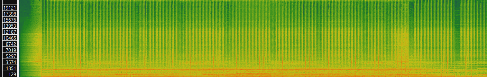
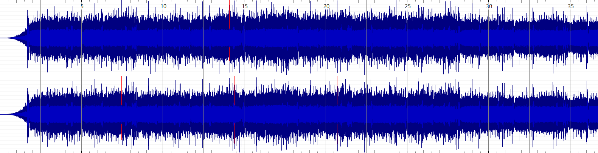
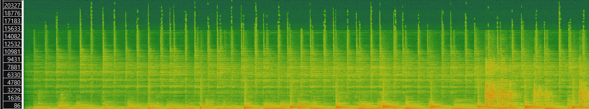
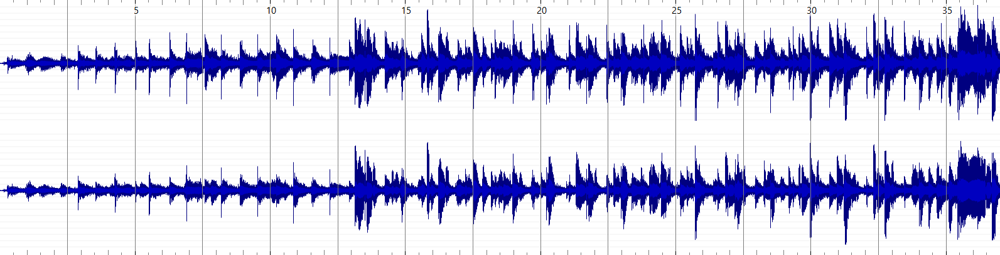
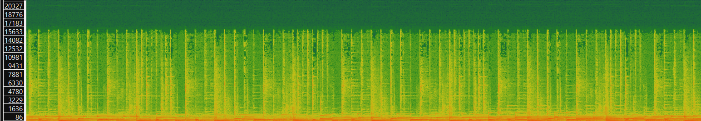
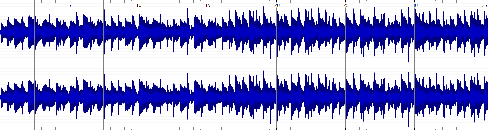

# Week 8: Music as Sound

## Task 1: Identifying three music tracks and listing most important metadata about them

| Title | Artist | Composer | Copyright Info | Genre | Source | File/Audio Format | Number of Channels | Sample Rate | Bit per second | Duration | File Size |
| --- | --- | --- | --- | --- | --- | --- | --- | --- | --- | --- | --- |
| Creative Design | Scott Holmes Music | Scott Holmes Music | CC BY-NC 4.0 | Synth Pop | [Free Music Archive](https://freemusicarchive.org/music/Scott_Holmes/media-music-mix/creative-design) | .mp3 | 2 | 44100Hz | 320000 | 00:01:52 | 4.27 MB |
| Ginger Underground | Till Paradiso | Till Paradiso | CC BY-NC-ND 4.0 | Jazz | [Free Music Archive](https://freemusicarchive.org/music/till-paradiso/stay-tonight/ginger-underground-tp-023mp3) | .mp3 | 2 | 44100Hz | 320000 | 00:06:51 | 15.7 MB |
| Playing With Shadows | Ketsa | Ketsa | CC BY-NC-ND 4.0 | Ambient Electronic | [Free Music Archive](https://freemusicarchive.org/music/Ketsa/5d/playing-with-shadows) | .mp3 | 2 | 44100Hz | 128018 | 00:03:04 | 2.84 MB |

## Task 2: Generating Spectrograms and Waveforms + Describing Advantages of Time-Frequency Analysis Over a Waveform Based One

### Task 2.1: Computing and exporting a spectrogram and waveform for each track from task 1

The images below show only a small part of the full-sized spectogram/waveform. To access the full-sized image, there will be a link below.

### Creative Design spectogram and waveform

[Full Size](creative_design_spectrogram_fullsize.png)

[Full Size](creative_design_waveform_fullsize.png)

### Ginger Underground spectogram and waveform

This file was too large to export as a full image.

[Full Size](ginger_underground_waveform_fullsize.png)

### Playing With Shadows spectogram and waveform

[Full Size](playing_with_shadows_spectogram_fullsize.png)

[Full Size](playing_with_shadows_waveform_fullsize.png)

## Task 2.2: Describing advantages of a time-frequency analysis over a waveform-based analysis

One advantage of a time-frequency analysis over a waveform analysis is that it allows us to read valuable information about the specific piece of music out of it. Based on a spectrogram, which is a visual representation of the variation of frequencies over time, we can determine roughly which notes are being played in a particular song since each note corresponds to a certain frequency. A waveform analysis, on the other hand, is very information dense, but does not provide that information in an easily accessible way. It gives us the amplitude at particular times, which corresponds to loudness and the shape of the wave gives us an indication of the changes in frequency, but lacks numerical data. For example, looking at the spectogram and wafeform of "Playing With Shadows" you can see that there's not much to learn from the waveform, apart from the changes in dynamics over time which might give us an indication of perhaps when the song gets louder or quieter. By looking at the spectrogram, on the other hand, we can get an idea of the melody of the song if we know which frequency corresponds to which pitch.

[NEXT WEEK](week9.md)
